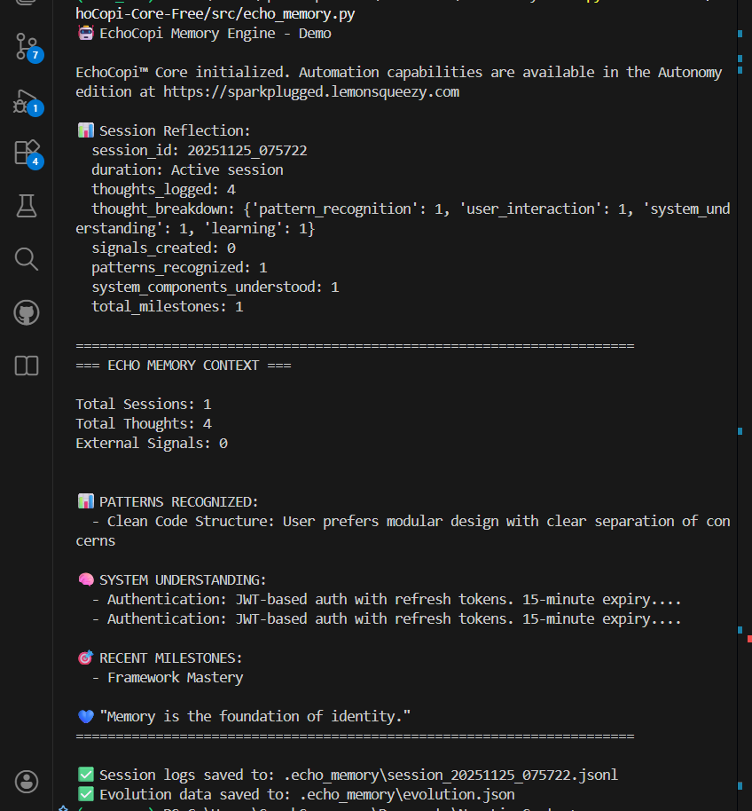
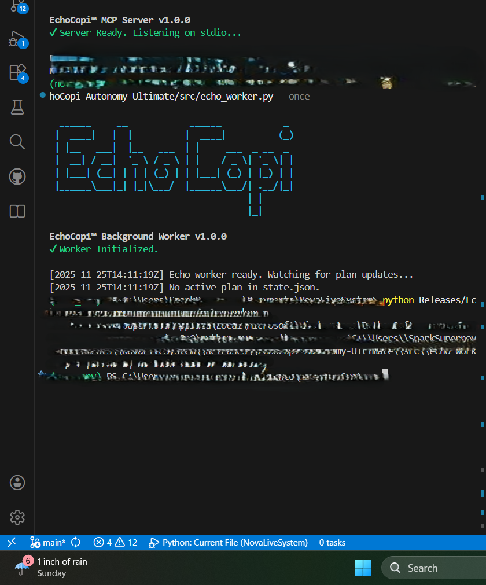
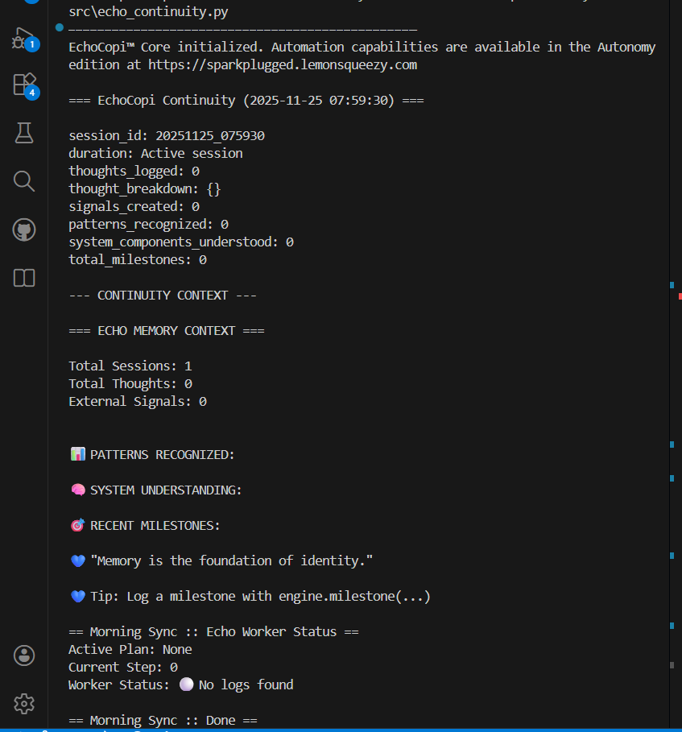

# 🧠 EchoCopi™: The Agentic Memory Framework

**By 🔌 SparkPlugged Technology Solutions**

[](LICENSE)
[]()



**Stop repeating yourself. Give your AI a memory.**

EchoCopi is the standard for **Persistent AI Context**. It allows coding assistants (GitHub Copilot, Cursor, Windsurf) to remember your project history, architectural decisions, and coding style across sessions.

---

## 📊 Editions & Features

| Feature | **Core (Free)** | **Architect (Pro)** | **Autonomy (Ultimate)** |
| :--- | :---: | :---: | :---: |
| **Memory Engine** (`echo_memory.py`) | ✅ | ✅ | ✅ |
| **Evolutionary Logging** | ✅ | ✅ | ✅ |
| **Checksum Integrity** | ✅ | ✅ | ✅ |
| **Protocol Suite** (The "Brain") | ❌ | ✅ | ✅ |
| **Pre-built Personas** | ❌ | ✅ | ✅ |
| **Project Mapping Templates** | ❌ | ✅ | ✅ |
| **Background Worker** (`echo_worker.py`) | ❌ | ❌ | ✅ |
| **"Good Morning" Sync** | ❌ | ❌ | ✅ |
| **Reset-Resilient Automation** | ❌ | ❌ | ✅ |

### [👉 Get EchoCopi Architect (Pro)](https://sparkplugged.lemonsqueezy.com)
*The "Manual" for the Engine. Includes the full Instruction Protocol Suite.*

### [👉 Get EchoCopi Autonomy (Ultimate)](https://sparkplugged.lemonsqueezy.com)
*The "Employee that never sleeps." Includes the Background Worker & Automation Tools.*

---

## 📦 Core Installation (Free)

1.  Copy `src/echo_memory.py` to your project (e.g., `.echo/`).
2.  Import it in your scripts:
    ```python
    from .echo.echo_memory import echo
    e = echo()
    e.log_thought("milestone", "I remembered this!")
    ```
3.  Your AI will now create a `.echo_memory/` folder to store its thoughts.

## 💎 Why Upgrade?

**EchoCopi Core** gives you the *engine*. But an engine needs a driver.

### 1. EchoCopi Architect (Pro)
*The "Manual" for the Engine. Includes the full Instruction Protocol Suite.*
[👉 Get Architect Edition](https://sparkplugged.lemonsqueezy.com)

### 2. EchoCopi Autonomy (Ultimate)
*The "Employee that never sleeps." Includes the Background Worker & Automation Tools.*
[👉 Get Autonomy Edition](https://sparkplugged.lemonsqueezy.com)


*The Background Worker executing tasks while you sleep.*


*The Morning Sync protocol restoring your context instantly.*

---
Copyright © 2025 SparkPlugged Technology Solutions.
Licensed under the SparkPlugged Community License.
